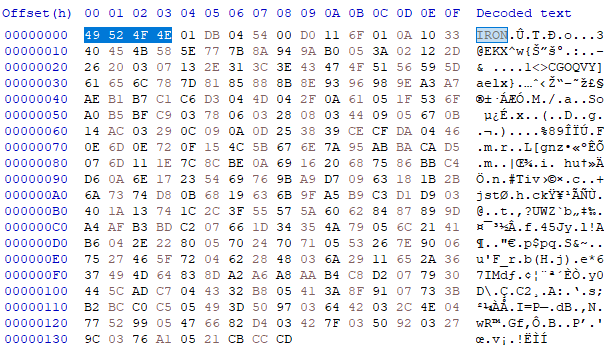
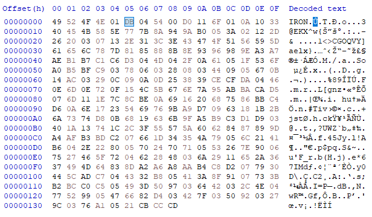
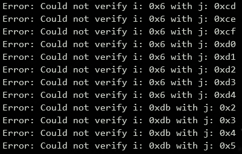
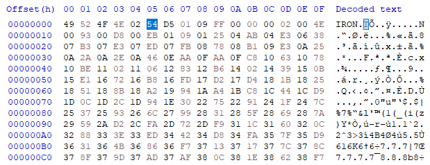
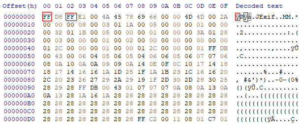
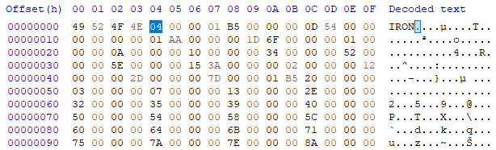
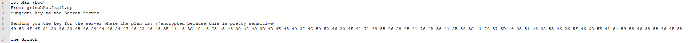
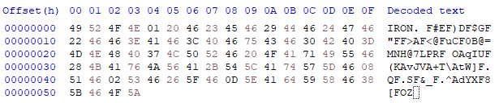

# Intercept Writeup
## Finding the format
### First steps
We start off by looking at the file structure and the README. We can immediately see that these set of files go together:

* Intercept 1
	* `Challenges/intercept1.txt`
	* `Challenges/intercept1.iron`
* Intercept 2
	* `Challenges/intercept2.jpg`
	* `Challenges/intercept2.iron`

Starting off, the `.iron` file is pretty awkward. `file` and `binwalk` give us absolutely nothing useful on the format, we're on our own. Obviously, because of the structure of the challenge and the fact his is a challenge, we're left to guess we need to figure out the format by our own anyways.

### Going in
Taking the first intercept and going in a Hex Editor (HxD in this case), we can immediately see a few magic bytes:



Next step is peeling through the actual data. If we look at any format's structure, we normally see size values for the parser to have it easy. This is also a requirement for C because it must know the size to allocate for (unless the devs abused `realloc`). So, when analyzing new formats, we need to keep in mind that we could write a decompressor in C, and in turn, we'd need crucial info about the output such as its size. So if we take the file size of `Challenges/intercept1.txt` (219 bytes or 0xDB bytes), and look through the file for the size we find that at offset 0x05 it appears. This is pretty good since it's early on in the file meaning it's most probably the header.



After reading the seemingly random bytes, we can notice that **a lot** of ASCII text is in the file. There's not enough to construct a string, but there's surely enough to construct the string from the original file. So because we have no idea what to look for, we start by looking at encoding strategies. For this challenge, it was chunking, but you might have to explore different strategies normally to find the format. So by looking at the first byte after our current understanding of the end of the header, we see 0x04, which is absolutely useless in relation to our input. Next byte is 0x54, which has an ASCII equivalent of `T`. If we look at our input, well it's the first character! Looking at the next byte we see 0x0, could this be offset 0x0? Looking at the next byte we see 0xD0, and at 0xD0 we see another `T`!! This is great news. Next byte is 0x11, do we have `T` at 0x11? Nope. Looking back we find our lost 0x4 and what offset are we at when the value as an offset in the input isn't a `T`? 0xA. And what offset is 0x04 at? 0x6. If we do 0xA - 0x6 it gives us our 0x4! This probably means that we have a chunk looking like this:

```c
struct chunk {
	unsigned char chunkSize;
	char value;
	char positions[chunkSize - 2];
};
```

Now we're getting somewhere :)

### Pursuing with this knowledge
We can now try and verify this with the remaining bytes in our file (we'll automate it with a simple script) (if you do it manually it'll still work)

```py
import sys

with open('intercept1.txt', 'rb') as f:
	verification = f.read()

with open('intercept1.iron', 'rb') as f:
	iron_buf = f.read()

i = 6  # We start at 0x5
while i < len(iron_buf):
	j = 2
	while j < iron_buf[i]:
		if iron_buf[i + 1] != verification[iron_buf[i + j]]:
			print('Error: Could not verify i: 0x%x with j: 0x%x' % (i, j))
		j += 1
	i += iron_buf[i]
```

So our final struct would look something like this:

```c
struct iron {
	char magicBytes[4];
	unsigned char unknown;
	unsigned char fileSize;
	struct chunk *chunks;
};
```

So now let's try verifying the .jpg file. And of course, we get a ton of errors:



Time to do more forensics!

### Finding out how the format really works
When we open the Iron encoded file in HxD, we already see a huge difference, firstly, the size:



This makes no sense! Our original JPG file is 21717 bytes or 0x54D5 bytes. Could this be encryption? If we look carefully though, we notice the JPG file is too big to enter our current understanding of the format (21717 > 255 (255 because size is a single byte)). Maybe it's compressed? But if we look at the next byte we see a 0xD5. Familiar? It's the same value as our Jpg's size! 0x54D5 and 0x54 0xD5. So we've gone to a `short` now? How would a parser understand the difference? Well if we remember there's another useless byte at 0x4 which was 1 in the first intercept and is now 2. This might be indicating each unit's size! Let's continue with our manual scan...

The first chunk would start at 0x7. Again, if we have 2 byte size, we most probably have 2 byte offsets and chunk sizes. If we interpret this as 2 bytes, it gives us 0x109. Now for the value of our chunk, since the file's size is 2 bytes, we don't necessarily have 2 byte values, and eitherway what are 2 byte bytes? They can just be deconstructed into single bytes. So if we go to the start of the positions and try the same thing as before, we can xref the 0xFF (value byte) to 0x0000 and 0x0002 and we can see they both match!



We can still verify this by automating it but I won't provide a script for this one because there's gonna be too much `struct.unpack`ing :p. All code should be in `iron.py` anyways.

### Time for the finale
So now that we've done all the heavy work and understood the format deeply, we're ready for the flag! If we open `intercept3.iron` in HxD we can immediately see that..



...We have another problem on our hands. But, since we already have done this from 1 to 2 bytes, from 2 to 4 isn't that hard. After we're done we can decode it to get this message:



From the README, we know the flag is in the format `flag{FLAG_HERE}`, so this line is obviously not our flag. All the values seem to correspond to Hex encoding, which is just encoding bytes using their Hex form in plain ASCII text. If we convert it to a real file, it looks something like this:



### Brute force to victory!
If we use the previous techniques shown, we'll find out it messes up at one point or another, and that the bytes make no sense at all. If we look at the secret message though, we see this curious string:

`^encrypted because this is pretty sensitive`

And what is this `^`? More often than not, it's used as a XOR operator symbol, and XOR is also used in... encryption! What's fun in this scenario is that our unit size is 0x1 so that means that our XOR key is in the range `0 <= key <= 255`, because or else it would give us values above 255 which would not be valid bytes ;). By bruteforcing all the seemingly random bytes we find (or all the bytes that are not in the header), we find that at ^69 our message becomes a valid Iron file and we can decode it and find our flag:

`flag{y0uxrex4xm34n13MrGr1ncH!!}`
