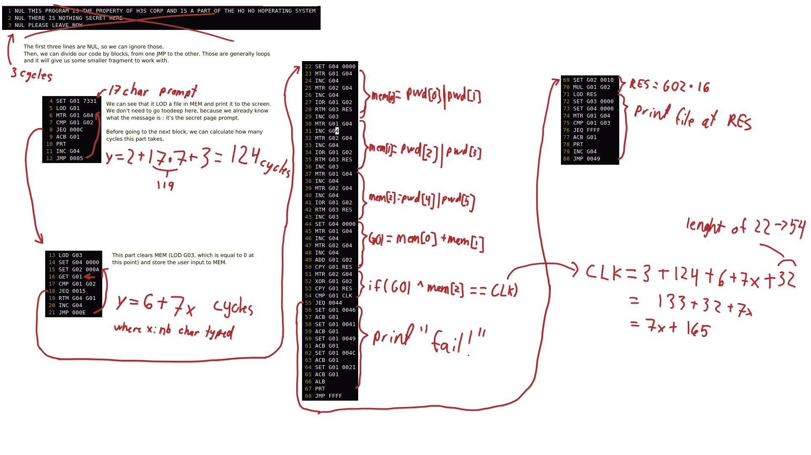

# Ho Ho No - Part 2 - Writeup by Zuyoutoki
## The challenge
We need to find a way to bypass a password protected page and read the content of the file it protects. You can access the secret page by typing `secret` when prompted for code. 
## The hint
We were given a PDF during the first challenge, but no code sample. However, the login prompt says that there is one. So either it lied, or we haven't read it. 

To access the code sample, you need to realize that the file that you thought was a PDF was a PDF/ZIP polyglot. A file polyglot is something that can be parsed as either of its identities. Using a PDF reader will open the H3S End User Manual and using `unzip` will extract `secret.h3s`. A way to verify that would be to use a tool like `binwalk` and look at the output: 
```
$ binwalk H3S-End_User_Manual.pdf
DECIMAL       HEXADECIMAL     DESCRIPTION
--------------------------------------------------------------------------------
0             0x0             Zip archive data, at least v2.0 to extract, compressed size: 294, uncompressed size: 925, name: secret.h3s
442           0x1BA           End of Zip archive, footer length: 22
464           0x1D0           PDF document, version: "1.6"
... snip ...
```
## The content of `secret.h3s`
```
NUL THIS PROGRAM IS THE PROPERTY OF H3S CORP AND IS A PART OF THE HO HO HOPERATING SYSTEM
NUL THERE IS NOTHING SECRET HERE
NUL PLEASE LEAVE NOW
SET G01 7331
LOD G01
MTR G01 G04
CMP G01 G02
JEQ 000C
ACB G01
PRT
INC G04
JMP 0005
LOD G03
SET G04 0000
SET G02 000A
GET G01
CMP G01 G02
JEQ 0015
RTM G04 G01
INC G04
JMP 000E
SET G04 0000
MTR G01 G04
INC G04
MTR G02 G04
INC G04
IOR G01 G02
RTM G03 RES
INC G03
MTR G01 G04
INC G04
MTR G02 G04
INC G04
IOR G01 G02
RTM G03 RES
INC G03
MTR G01 G04
INC G04
MTR G02 G04
INC G04
IOR G01 G02
RTM G03 RES
INC G03
SET G04 0000
MTR G01 G04
INC G04
MTR G02 G04
INC G04
ADD G01 G02
CPY G01 RES
MTR G02 G04
XOR G01 G02
CPY G01 RES
CMP G01 CLK
JEQ 0044
SET G01 0046
ACB G01
SET G01 0041
ACB G01
SET G01 0049
ACB G01
SET G01 004C
ACB G01
SET G01 0021
ACB G01
ALB
PRT
JMP FFFF
SET G02 0010
MUL G01 G02
LOD RES
SET G03 0000
SET G04 0000
MTR G01 G04
CMP G01 G03
JEQ FFFF
ACB G01
PRT
INC G04
JMP 0049
```
## Poking at the prompt
When entering the secret page, we get that prompt:
```
> Enter your code. An empty line will execute
secret
Parsing your code... ok
Running your code...
SECRET PAGE
PWD:
```
This tells use 2 things : first, secret loads some sort of program in IMEM and runs it. Second, it's a password prompt. We got ourself a crackme in H3S language to solve!

After poking at it for a while, you realize the following:
```
0 char password: `Execution completed in 180 cycle(s)
1 char password: `Execution completed in 187 cycle(s)
2 char password: `Execution completed in 194 cycle(s)
...
```
From that, we can learn that the total number of cycles when the password is wrong is equal to `7x+180`, where x is the password length. Not really useful for now, but it might be later on.
## Reversing `secret.h3s`
A video would be better, but here's a whiteboard with explanations.


We now have two way to solve this challenge : 1. make a keygen and try increasingly longer passwords until we find the file, or 2. use our solution of the first challenge to go and read the file at all the addresses returned by the CLK formula.

## Solution with keygen
```python
#!/usr/bin/env python3
from itertools import product
import sys, random
charset = "0123456789abcdefghijklmnopqrstuvwxyzABCDEFGHIJKLMNOPQRSTUVWXYZ!\"#$%&'()*+,-./:;<=>?@[\\]^_`{|}~ "

def is_valid(passwd):
    a = []
    a[:0] = passwd
    ol = len(a)
    while len(a) < 6:
        a.append("\x00")
    a = [ord(c) for c in a]
    if ((7*ol + 0XA5) == (((a[0]|a[1])+(a[2]|a[3]))^(a[4]|a[5]))):
        return True
    else:
        return False

def find_valid_password(a):
    for attempt in product(charset, repeat=a):
        if (is_valid(attempt[::-1])):
            print('"'+"".join(attempt[::-1])+'"')
            return
    print("No valid password found :(")

if __name__ == "__main__":
    if (len(sys.argv) != 2):
        print("usage: {} <length>".format(sys.argv[0]))
    else:
        find_valid_password(int(sys.argv[1]))
```
We try different length until we get one that open the right file.

Examples of valid keys:
```
1 char:  no valid password
2 char:  no valid password
3 char:  "XAa"
4 char:  "PPa0"
5 char:  "o0i00"
6 char:  maybe there is one, but it took too much time to calculate
7 char:  "e0a0000"
8 char:  "l0a00000"
9 char:  "baa000000"
10 char: "hba0000000"
11 char: "PAa00000000"
12 char: "PHa000000000"
13 char+: I tried a few, takes too much time to compute ¯\_(ツ)_/¯
```

Trying those different passwords, we can open it using the interface. We find that the right length was 11 char:
```
secret
Parsing your code... ok
Running your code...
SECRET PAGE
PWD: PAa00000000
This is the most secure location in this whole computer. I found it while playing around with it for a while. But, if you are reading this, you must have found the 11 characters long key that secures this file right? Anyway, there wasn't anything interesting here, except this dusty old flag, FLAG-CongratsForReversingAWeirdCrackMe

This computer is unusable, I couldn't find a way to read the data and I ended up overwriting it. Ooops. Please tell Santa I'm sorry and I'll come back in a few days with the list he needs: I gotta collect the data on the field. Wish me luck!

  - Dio, the Mischievious Elf
Execution completed in 4494 cycle(s)
```

The flag: FLAG-CongratsForReversingAWeirdCrackMe

## Solution with CLK formula + part 1
We get the following formula for the files that could be valid: `y = 16*CLK = 16*(7x+165) = 112x+2640`
Let's write a little code that will generate the list of possible files:
```python
for x in range(20): 
    print("{:04X}".format(112*x+2640))
```

The result for the right address (0F20, 11 char):
```
SET G01 0F20
LOD G01
MTR G01 G04
CMP G01 G02
JEQ FFFF
ACB G01
PRT
INC G04
JMP 0002

Parsing your code... ok
Running your code...
This is the most secure location in this whole computer. I found it while playing around with it for a while. But, if you are reading this, you must have found the 11 characters long key that secures this file right? Anyway, there wasn't anything interesting here, except this dusty old flag, FLAG-CongratsForReversingAWeirdCrackMe

This computer is unusable, I couldn't find a way to read the data and I ended up overwriting it. Ooops. Please tell Santa I'm sorry and I'll come back in a few days with the list he needs: I gotta collect the data on the field. Wish me luck!

  - Dio, the Mischievious Elf
Execution completed in 4247 cycle(s)
```

The flag: FLAG-CongratsForReversingAWeirdCrackMe

